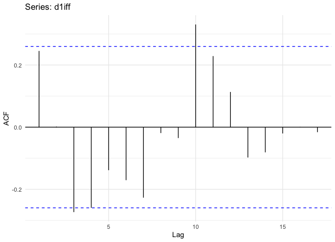

# Annual Median Home Sales Price Analysis

The analysis is on the median sales price of houses sold for the United States from 1963 to 2020.The dataset
used has been obtained from Federal Reserve Economic Data(FRED).

## Preliminary Analysis

  <figcaption>Fig 1: Time Plot</figcaption>
  
  <figcaption>Fig 2: Median Home Price in the United States (Nominal - Inflaction-adjusted)</figcaption>
   

From the figure 1 we can observe an increasing trend in 1963-2007, a changing direction with a decreasing trend in home prices
starting from 2007, probably due to subprime mortgage crisis, an increasing trend again until 2020.This is a
historical home price series using nominal prices, but data which are affected by the value of money are best adjusted,in fact,
probably,the median cost of a new house will have increased over the years due to inflation.For this reason,the series was adjusted
so that all values are stated in dollar values from a particular year.
The inflation-adjusted values were obtained by dividing the original prices values by their own CPI(Consumer Price Index) and
then multiplying by the reference year CPI. In this case we set 2000 as reference year.Also the CPI was obtained from FRED
In figure 2 we can see that the adjusted values curve were more flat than the original data and appears to be less smooth, the
positive trend seems, however, to remain. The positive trend is confirmed by decreasing autocorrelations in the acf plots(figures
3 and 4 ) but the autocorrelation of the original data decreases more fast than those of the inflaction-adjusted data.

  <figcaption>Fig 3: Acf original data</figcaption>
  

  <figcaption>Fig 4: Acf adjusted data </figcaption>
   

The series is annual and therefore has no seasonality so we can compute only the ”trend” component.In particular this component
was estimated using two approaches:

* Moving average smoothing
* LOWESS Smoothing

  
   
   
   

In the figures we can see the components of trend calculated with the moving average of order 15 and with the lowess for both
series.With both methods we can see that both series have an increasing trend but the transformed series has a more undulating
trend line with a series of ups and downs which confirms what was said previously.In general the loess method has been preferred
because with this we do not lose the first and last m/2 values of the trend. For the following steps only the inflaction-adjusted
series will be used.

It is necessary to obtain a stationary series. First we stabilize the variance using the box cox transformation, meanwhile for stabilise the mean it was used the First-difference.
As it appears from the ACF plot(figure 10), the series ∆Yt is stationary , aspect confirmed by the Augmented Dickey-Fuller stationarity test, for which we reject the null hypothesis of non-stationarity with a p-value=0.01.

  <figcaption>Fig 9: ACF Xt </figcaption>
  
  <figcaption>Fig 10: ACF ∆Yt</figcaption>
   

## Model Identification and Forecasting

Model Identification involves determining the order of the model required (p and q) in order to capture the salient dynamic features of the data.
Once the model has been identified we have to estimate the paremeters. For the choice of the model it has been chosen an interval of values for p and q with d=1:

* 0<p<4
* 0<q<4

subsequently were used the information criteria(AIC,SBIC) to discriminate among the competing model.

25 models have been estimated,the model that minimizes AIC is ARIMA(3,1,1),the one chosen by the minimizzation of SBIC is an
ARIMA(2,1,1).In figure 36 the are the acf, pacf and qqplot of the model chosen with SBIC.It appears that almost all correlations
in the residuals result from randomness of the sampling process, and from the q-q plot they appear normally distributed.What
has been said previously is checked by Ljung-Box test that confirms the null hypothesis of indipendence and from the Jarque-Bera
test that confirms the null hypothesis of Normality

