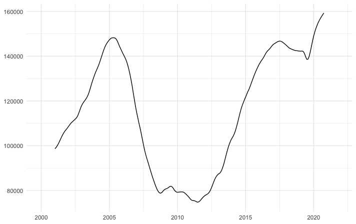
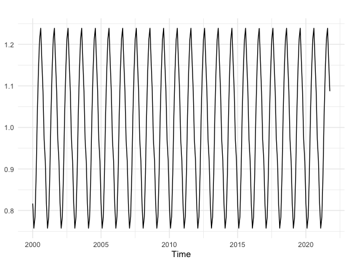
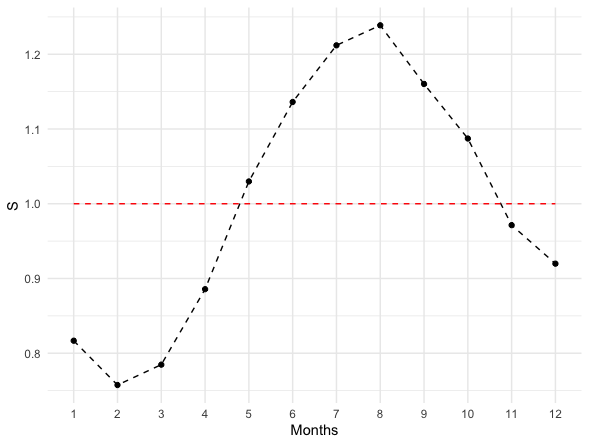
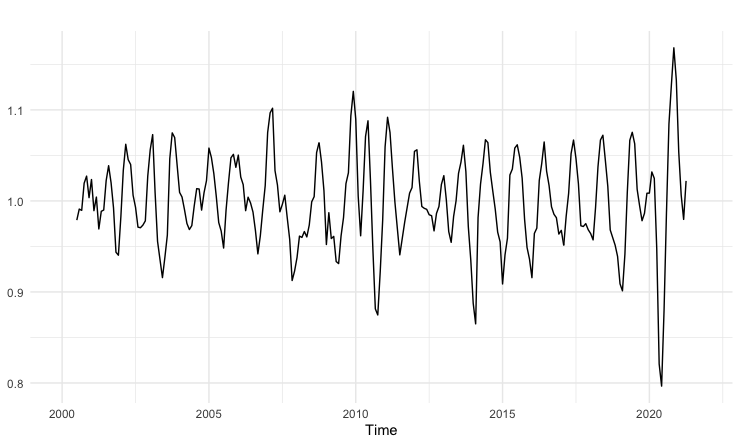
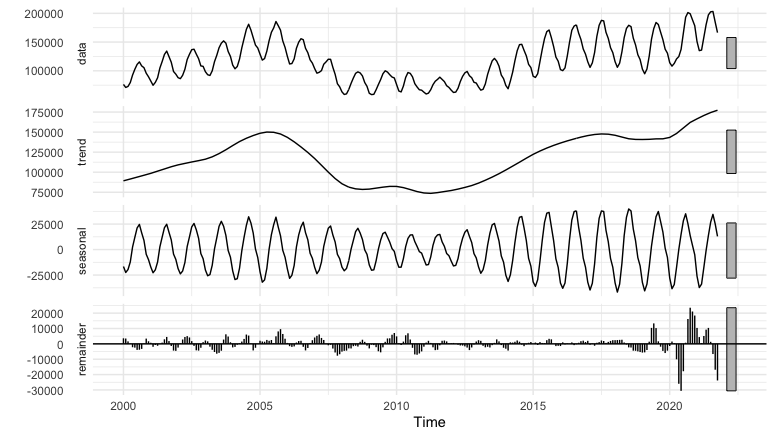
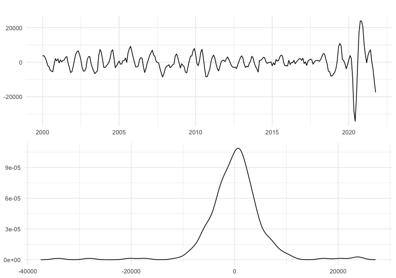
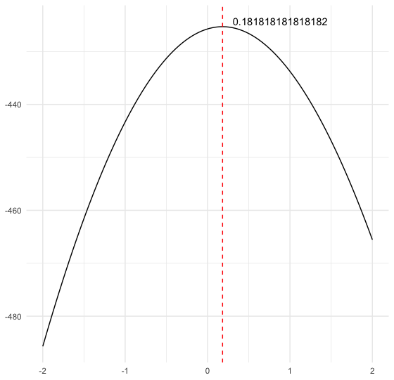
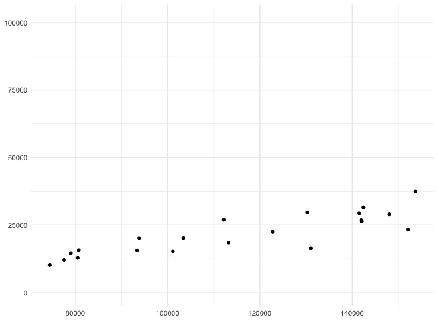
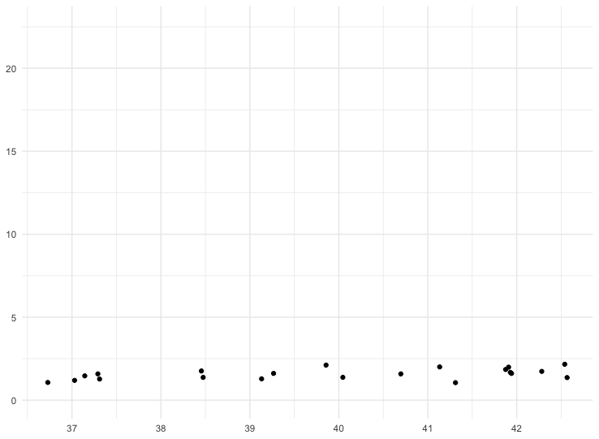

# Monthly Home Sales Analysis

The analysis is on the home sales of the 20 major U.S. metropolitan areas: Atlanta, Boston, Charlotte, Chicago, Cleveland,
Dallas, Denver, Detroit, Las Vegas, Los Angeles, Miami, Minneapolis, New York, Phoenix, Portland, San Diego, San Francisco,
Seattle, Tampa and Washington, D.C. The dataset used has been obtained from Federal Reserve Economic Data, an online
database with data representing the US economy from 1991.
The dataset contains 262 records, each record show a monthly home sales index between the years 2000 and 2021.

## Preliminary analysis

The assumption that our time series is a realization of a stationary process is clearly fundamental in time series analysis, so we
must first determine whether the series can be considered a realization of a stationary process.In this stage a very useful tool is
the graph of the series, many of the patterns in the data can be seen visually.

  

In the time series plot we can observe an increasing trend in 2000–2006, a changing direction with a decreasing trend in home
sales starting from 2006 probably due to subprime mortgage crisis, an increasing trend again from 2012. We can also observe
seasonality. It is possible to investigate this last aspect with the Seasonal and Seasonal Subseries plot. In a seasonal plot the
data are plotted against the individual ”seasons” in which the data were observed making a curve for each year 2a.In a Seasonal
subseries plot the data for each season are collected together in separate mini time plots and the horizontal lines, indicate the
means for each season 2b.

  
   

In both graphs we can see a clear increase in sales in the summer months, in particular from June to September, with a decrease in sales in the winter months, with the lowest average sales value observed in the month of February.

To better understand the behavior of the series we can use decomposition, that is a procedure which split the original time series into component series:

* Trend-cycle component (Tt)
* Seasonal component (St)
* Remainder component (Rt)

There are two classic methods of decomposition:

* Additive Decomposition

Xt= St + Tt + R t

This model is appropriate if magnitude of seasonal fluctuations does not vary with level of the series.

* Multiplicative Decomposition

Xt= St * Tt * R t

This model is appropriate if magnitude of seasonal fluctuations are proportional to level of the series.

In this case we can see from figure that the magnitude of seasonal fluctuations are smaller when the trend decrease and are bigger when the trend increase, so in this case a multiplicative model can be more appropriate.
As said before, we must split the original time series into component series, it can be done in this steps:

* if m(seasonal period) is an even number, we compute the trend-cycle component using 2m-MA(Moving Average of order 2m).In this case m = 12 so we must compute 24-MA.

The trend component in figure confirm what was said above, there is a strong collapse from 2006 and a fast rise from 2012 with an interval (2019-2020) where there was a decrease in sales maybe due to "COVID-19" pandemic.

* Calculate the detrended series Xt/Tt and estimate the seasonal component for each season taking the average of the detrended values for the season.

In the figure 4 there is the fixed seasonal component plot for every year, in particular on graph in figure 5 we can see in
detail that the months with positive effect on the sales(above the red line) are those between 5 and 10, meanwhile the
winter months have negative effects on the sales(1 to 4 and 11 to 12

* In the end the remainder component is calculates dividing the series by T*S.

  
   
   
   

These classic approaches are easy to apply but have some disadvantages, for example the estimate of the trend-cycle is unavaible
for the first few and last few observation, in this case with m=12, there is no trend-cycle estimate for the first six and the last
six observations.Consequently there is also no estimate of the remainder component for the same time periods.Moreover this
classical decomposition methods assume that the seasonal component repeats from year to year.
Therefore now we use a more robust method for decomposing time series. The Seasonal and Trend decomposition using
Lowess(STL) is a robust method that has several advantages:will handle any type of seasonality,the seasonal component is
allowed to change over time and it does not present the problem of missing values for the first and last m/2 observations of the
trend.

For the STL decomposition it is used the stl function in R-package, the two main parameters to be chosen when using STL
are the trend-cycle window and the seasonal window season.Both trend and seasonal windows should be odd numbers; trend
window is the number of consecutive observations to be used when estimating the trend-cycle; season window is the number of
consecutive years to be used in estimating each value in the seasonal component.In this case the season window has been set to
7 that allows more rapid changes meanwhile the value of the trend window has been left by default.

  
   

With the STL decomposition (figure 7), the trend is similar to that calculated with the multiplicative decomposition but is
more ”smooth”,moreover the seasonal component varies over the time and it is stronger when sales increase, weaker when
they decrease.The residues obtained from the STL are close to 0 except for the last observations where the remainders are
greater(figure 8).

For what has been said in the previous analysis the series is not stationary.
The data must be transformed to have a stationary process.A time series can be considered a realization of a stationary stochastic
process if:

* if there is no systematic change in variance,

To achieve omoschedasticity a Box-Cox transformation can be used.The problem is to find λ∗ such that the series is as omoschedastic as possible.Box and Cox (1964) proposed choosing the appropriate value of ￿ based on maximizing the likelihood function, so using the MASS package was found λ∗ = 0.1818
(figure 9).We can see that with this λ∗ the Box-Cox transformation makes the standard deviation invariant respect to the mean (figure 11), as opposed to the plot on the original data (figure 10)

With the STL decomposition (figure 7), the trend is similar to that calculated with the multiplicative decomposition but is
more ”smooth”,moreover the seasonal component varies over the time and it is stronger when sales increase, weaker when
they decrease.The residues obtained from the STL are close to 0 except for the last observations where the remainders are
greater(figure 8).

For what has been said in the previous analysis the series is not stationary.
The data must be transformed to have a stationary process.A time series can be considered a realization of a stationary stochastic
process if:

* there is no systematic change in variance,

To achieve omoschedasticity a Box-Cox transformation can be used.
The problem is to find λ∗ such that the series is as omoschedastic as possible.Box and Cox (1964) proposed choosing the
appropriate value of ￿ based on maximizing the likelihood function, so using the MASS package was found λ∗ = 0.1818
(figure 9).We can see that with this λ∗ the Box-Cox transformation makes the standard deviation invariant respect to the
mean (figure 11), as opposed to the plot on the original data (figure 10).

  
   
   

