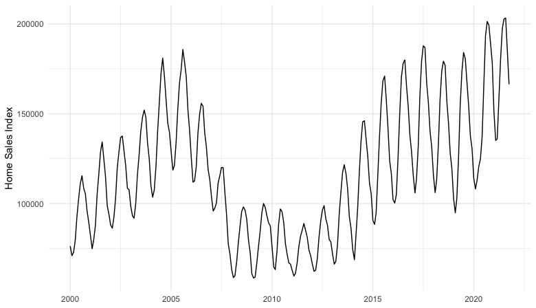
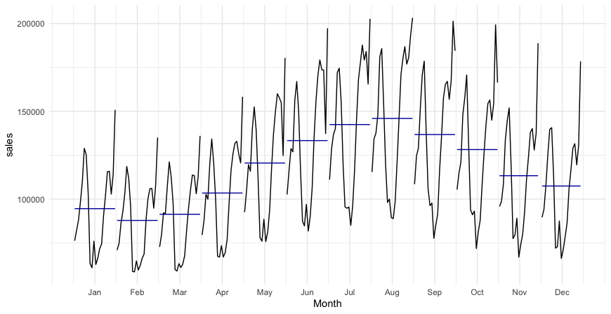
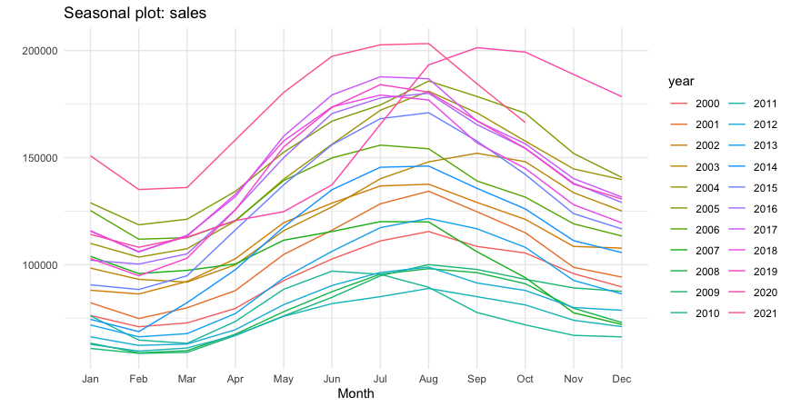

# Monthly Home Sales Analysis

The analysis is on the home sales of the 20 major U.S. metropolitan areas: Atlanta, Boston, Charlotte, Chicago, Cleveland,
Dallas, Denver, Detroit, Las Vegas, Los Angeles, Miami, Minneapolis, New York, Phoenix, Portland, San Diego, San Francisco,
Seattle, Tampa and Washington, D.C. The dataset used has been obtained from Federal Reserve Economic Data, an online
database with data representing the US economy from 1991.
The dataset contains 262 records, each record show a monthly home sales index between the years 2000 and 2021.

## Preliminary analysis

The assumption that our time series is a realization of a stationary process is clearly fundamental in time series analysis, so we
must first determine whether the series can be considered a realization of a stationary process.In this stage a very useful tool is
the graph of the series, many of the patterns in the data can be seen visually.

  

In the time series plot we can observe an increasing trend in 2000–2006, a changing direction with a decreasing trend in home
sales starting from 2006 probably due to subprime mortgage crisis, an increasing trend again from 2012. We can also observe
seasonality. It is possible to investigate this last aspect with the Seasonal and Seasonal Subseries plot. In a seasonal plot the
data are plotted against the individual ”seasons” in which the data were observed making a curve for each year 2a.In a Seasonal
subseries plot the data for each season are collected together in separate mini time plots and the horizontal lines, indicate the
means for each season 2b.

  
   

In both graphs we can see a clear increase in sales in the summer months, in particular from June to September, with a decrease in sales in the winter months, with the lowest average sales value observed in the month of February.

To better understand the behavior of the series we can use decomposition, that is a procedure which split the original time series into component series:

* Trend-cycle component (Tt)
* Seasonal component (St)
* Remainder component (Rt)

There are two classic methods of decomposition:

* Additive Decomposition

Xt= St + T1 + R t

This model is appropriate if magnitude of seasonal fluctuations does not vary with level of the series.

* Multiplicative Decomposition

Xt= St * T1 * R t

This model is appropriate if magnitude of seasonal fluctuations are proportional to level of the series.

In this case we can see from figure that the magnitude of seasonal fluctuations are smaller when the trend decrease and are bigger when the trend increase, so in this case a multiplicative model can be more appropriate.
As said before, we must split the original time series into component series, it can be done in this steps:

* if m(seasonal period) is an even number, we compute the trend-cycle component using 2m-MA(Moving Average of order 2m).In this case m = 12 so we must compute 24-MA.

The trend component in figure confirm what was said above, there is a strong collapse from 2006 and a fast rise from 2012 with an interval (2019-2020) where there was a decrease in sales maybe due to "COVID-19" pandemic.

* Calculate the detrended series Xt/Tt and estimate the seasonal component for each season taking the average of the detrended values for the season.
